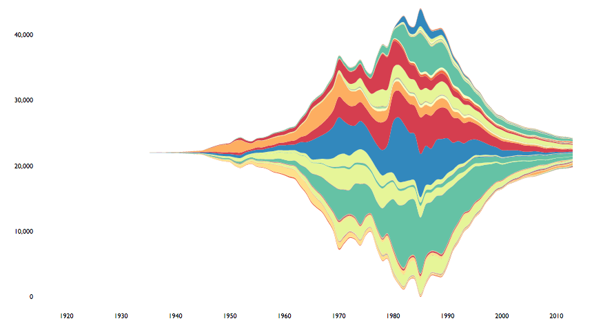

streamgraph is an htmlwidget for making streamgraphs.



[Sample Rmd](http://rpubs.com/hrbrmstr/59200)

A streamgraph (or "stream graph") is a type of stacked area graph which is displaced around a central axis, resulting in a flowing, organic shape. Streamgraphs were developed by Lee Byron and popularized by their use in a February 2008 New York Times article on movie box office revenues. ([Wikipedia](http://en.wikipedia.org/wiki/Streamgraph))

The x axis values can be continous or dates.

### TODO

-   Support is planned for `xts` objects, but not for a bit.
-   Support for categorical/discrete x axis

The following functions are implemented:

-   `streamgraph` : Create a new streamgraph
-   `sg_axis_x` : Modify streamgraph x axis formatting
-   `sg_axis_y` : Modify streamgraph y axis formatting
-   `sg_colors` : Modify streamgraph axis text, legend popup label text and tooltip text colors (NOTE: no longer modifies fill colors, use `sg_fill_*` for fill colors)
-   `sg_legend` : Add select menu "legend" to interactive streamgraphs
-   `sg_fill_brewer` : Specify a ColorBrewer palette to use for the stream fills
-   `sg_fill_manual` : Specify a manual color palette to use for the stream fills
-   `sg_fill_tableau` : Specify a Tableau color palette to use for the stream flls
-   `sg_add_marker` : Annotate streamgraph with vertical line and label
-   `sg_annotate` : Annotate streamgraph with a label

### News

-   Version `0.8` released - support for negative Y axis numbers and upgrade to latest D3
-   Version `0.7.5` released - `key`, `value` and `date` can be either bare or quoted
-   Version `0.7` released - New `sg_add_marker` and `sg_annotation` to enable annotation of streamgraphs
-   Version `0.6` released - New `scale` parameter to `streamgraph` lets you choose between continuous or date scales.
-   Version `0.5.1` released - `sg_colors` now has nothing to do with the stream fills but *does* set the axis text, legend popup label text and tooltip text.
-   Version `0.5` released - deprecated use of `sg_colors`. Its functionality will change soon and is replaced by three `sg_fill_*` functions (`brewer`, `manual` and `tableau`) which makes more sense, is aligned to the `ggplot2` way of specifying fill aesthetics and now makes it easier to highly customize the streamgraph appearance.
-   Versioin `0.4.2` released - fixed bug (thanks to teammate @bhaskarvk) that causes inconsistent color rendering for each area component (noticeable on resize of flexible width/height graphs)
-   Version `0.4.1` released - removed warning message when supplying `POSIXct` values (remember, `POSIXct` still only works for granularities \>= 1 day)
-   Version `0.4` released - select menu "legend" (interactive only)
-   Version `0.3.1` released - bug fix to fix error with `d3.stack`; `streamgraph` will now see if the date input is a year and automatically convert it to the necessary format (no need to use `as.Date`)
-   Version `0.3` released - folks can have some fun with new `offset` and `interpolate` parameters to `streamgraph`
-   Version `0.2.2` relased - rly rly rly fixed tooltips now, also assed ability to format y axis text
-   Version `0.2.1` released - ok, working tool tips for realz now
-   Version `0.2` released - working SVG tooltips; general code cleanup
-   Version `0.1` released

### Installation

``` r
devtools::install_github("hrbrmstr/streamgraph")
```

### Usage

``` r
library(streamgraph)

# current verison
packageVersion("streamgraph")

library(dplyr)

ggplot2::movies %>%
  select(year, Action, Animation, Comedy, Drama, Documentary, Romance, Short) %>%
  tidyr::gather(genre, value, -year) %>%
  group_by(year, genre) %>%
  tally(wt=value) -> dat

streamgraph(dat, "genre", "n", "year", interactive=TRUE) %>%
  sg_axis_x(20, "year", "%Y") %>%
  sg_fill_brewer("PuOr")
```

### Test Results

``` r
library(streamgraph)
library(testthat)

date()
```

    ## [1] "Fri Aug  7 15:24:28 2015"

``` r
test_dir("tests/")
```

    ## testthat results ========================================================================================================
    ## OK: 0 SKIPPED: 0 FAILED: 0
    ## 
    ## DONE
